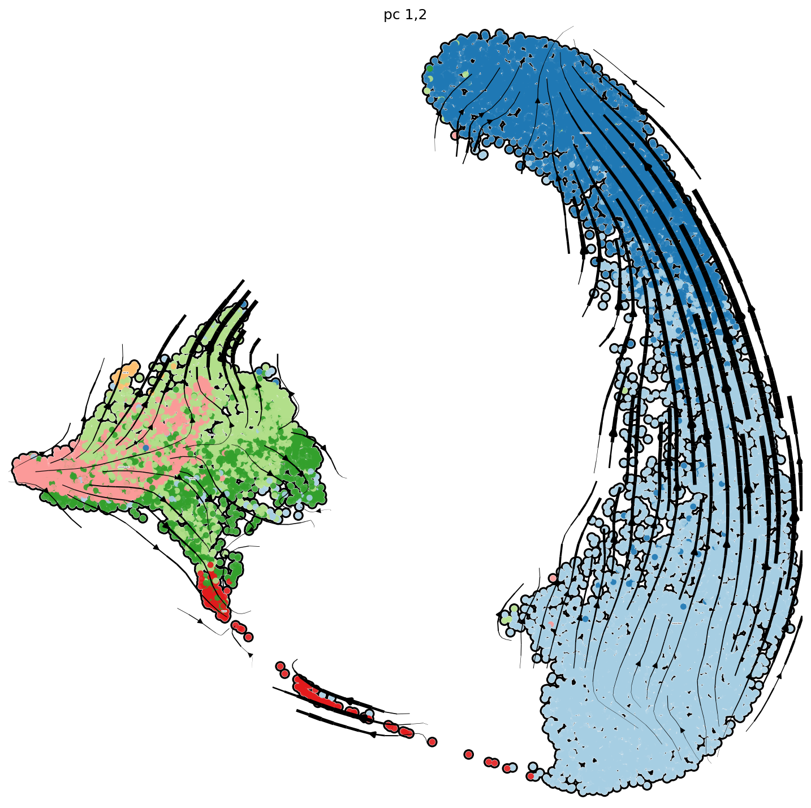
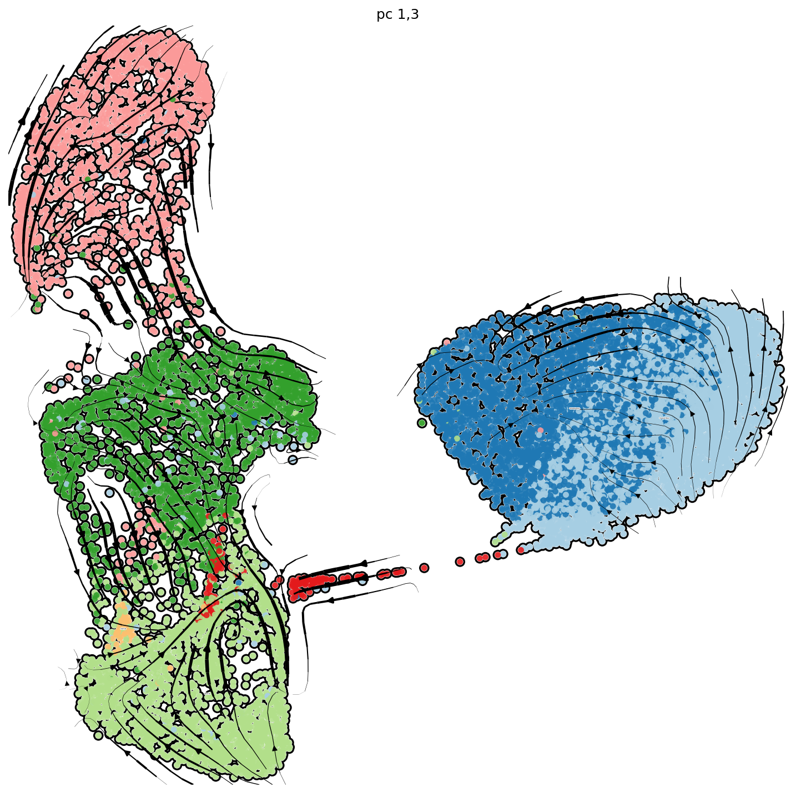

```{r include=FALSE}
knitr::opts_chunk$set(message = FALSE, warning = FALSE)
```

\newpage

# Description

To confirm the differentiation from classical monocytes to IM passing by the transit cells, the cell fate or differentiation direction of each single cells were predicted by RNA velocity. 
Briefly, the counts for spliced-, unspliced- and ambiguous transcripts were calculated from CellRanger output using velocyto command-line tool (http://velocyto.org) [@LaManno2018] and saved in loom files. The single-cell RNA velocities were estimated using scVelo toolkit (https://scvelo.readthedocs.io) [@Bergen2020]. The loom files were used as input for scVelo analysis. Genes with minimum 20 of both unspliced and spliced counts and on the top list of 2000 genes were filtered, normalized and log transformed (scv.pp.filter_and_normalize with default parameters). Thirty principal components (PCs) and 30 neighbors obtained from euclidean distances in PCA space were used for computing first-/second-order moments for each cell. We used generalized dynamical modeling to recover the full splicing kinetics of spliced genes and the single-cell RNA velocities were plotted with the same cluster labels and embedding as in Figure 4B.

# Load data 

```{r}
# packages
suppressMessages(library(Seurat))
suppressMessages(library(tidyverse))
suppressMessages(library(RColorBrewer))

obj3d.combined <- readRDS("../6-Merge_two_experiments/immune_imdtr3.seuratObject.Rds")
```

# Prepare data from Seurat object for RNAvelocyto

```{r}
list.name.so <- unique(obj3d.combined$treatment)
list.name.sample <- list.name.so

for (i in 1:length(list.name.so)) {
  so <- obj3d.combined[, obj3d.combined$treatment == list.name.so[i]]
  assign(paste(list.name.sample[i], "seuratObject", sep = "."), so)
}

list3d.name.so <- paste(list.name.sample, "seuratObject", sep = ".")

obj.list <- list()
for (name.so in list3d.name.so) {
  obj.list <- c(obj.list, get(name.so))
}

names(obj.list) <- list.name.so
```

# Generate loom files

> The intermediate loom files were too big to be uploaded to the platform but they can be produced by the following steps. 

We counted spliced, unspliced and ambiguous transcripts using velocyto command-line tool (http://velocyto.org)[@LaManno2018]. 

For each sample, the following code was used to generate the loom file: 

```{bash eval=FALSE}
velocyto run 	-b "${sampleID}/outs/filtered_feature_bc_matrix/barcodes.tsv.gz" \
 				      -o "outputDir/${sampleID}.loom" \
 				      "${sampleID}/outs/possorted_genome_bam.bam" \
 				      /GRCm38/genes/genes.gtf
```

- `${sampleID}` is the sample ID. 
- `${sampleID}/outs` is the output directory of CellRanger. 
- `${sampleID}/outs/possorted_genome_bam.bam` is the BAM file generated from CellRanger. 
- `/GRCm38/genes/genes.gtf` is the gene reference used for Cellranger counts. 


# Add cell spliced/unspliced counts to Seurat objects

```{r}
suppressMessages(library("velocyto.R"))
```

## Load IM-DTR1 loom data (Exp1)
```{r include=FALSE}
list.path.loom <- list.dirs("../../../IM_DTR_exp1/counts/loom")
list.path.loom <- list.path.loom[-1] # remove the first parent directory: Counts/loom/
```

```{r eval=FALSE}
list.path.loom <- list.dirs("../IM-DTR1/counts/loom")
list.path.loom <- list.path.loom[-1] # remove the first parent directory: Counts/loom/
```

```{r}
list.name.loom <- basename(list.path.loom)
list.name.loom <- str_replace(list.name.loom, pattern = "-", replacement = "_")
list.path.loom <- list.files(list.path.loom, pattern = "\\.loom$", full.names = TRUE)

for (i in 1:length(list.name.loom)) {
  assign(make.names(list.name.loom[i]), read.loom.matrices(list.path.loom[i]))
}
```

## Load IM-DTR2 loom data (Exp2)

```{r eval=FALSE}
list.path.loom <- list.dirs("../IM-DTR2/counts/loom")
list.path.loom <- list.path.loom[-1] # remove the first parent directory: Counts/loom/
```


```{r include=FALSE}
list.path.loom <- "../../../IM_DTR_exp2/counts/loom/CD45Plus_NGS21-S229.loom/"
```


```{r}
list.name.loom <- basename(list.path.loom)
list.name.loom <- str_replace(list.name.loom, pattern = "-", replacement = "_")
list.path.loom <- list.files(list.path.loom, pattern = "\\.loom$", full.names = TRUE)

for (i in 1:length(list.name.loom)) {
  assign(make.names(list.name.loom[i]), read.loom.matrices(list.path.loom[i]))
}
```


# Make consistancy of cell names in Loom and Seurat object

## For 4-day and 0-day data

*for the 4d and 0d data, we added "Cplus_" and "Plusplus_":*

```{r}
colnames(`4d.seuratObject`)[1:2]
```
```{r}
colnames(`0d.seuratObject`)[1:2]
```

Remove the "-1" from cell names: 
```{r}
obj.list$`4d` <- RenameCells(obj.list$`4d`, 
                                    new.names = sub(colnames(obj.list$`4d`), pattern = "-1", replacement = ""))

obj.list$`0d` <- RenameCells(obj.list$`0d`, 
                                    new.names = sub(colnames(obj.list$`0d`), pattern = "-1", replacement = ""))

```


add the prefix to loom file: 
```{r}
prefix <-  c("CPlus", "Plusplus")

source("../R/aggregateLoom.R")
for (i in 1:length(list.name.loom)) {
  loom <- get(list.name.loom[i])  
  assign(list.name.loom[i], value = aggregateLoom(loom, Ori.ID = prefix[i]))
}
```

Filter loom with Seurat gene/cell list
```{r}

`0d.loom` <- Plusplus_NGS20_Q148.loom
`4d.loom` <- CPlus_NGS20_Q147.loom

list.name.sample2 <- c("0d", "4d")
```

```{r}
source("../R/filterLoom.R")

# list.name.ldat <- paste(list.name.sample, "ldat", "filtered", sep = ".")
ldat.list <- list()

for (name.sample in list.name.sample2) {
  obj.name <- paste(name.sample, "seuratObject", sep = ".")
  loom.name <- paste(name.sample, "loom", sep = ".")
  ldat.name <- paste(name.sample, "ldat", "filtered", sep = ".")
  
  assign(ldat.name, 
         value = filterLoom(loomObj = get(loom.name),
                                geneList = rownames(obj.list[[obj.name]]),
                                cellList = colnames(obj.list[[obj.name]])))

}
```


## For IM-DTR2 data 

*For the 12h, 48h and 24h data, we don't have prefix in Seurat object (no integration done)*

```{r}
colnames(obj.list$`2d`)[1:2]
```
```{r}
colnames(obj.list$`0.5d`)[1:2]
```
```{r}
colnames(obj.list$`1d`)[1:2]
```

Remove the "-1" from cell names: 
```{r}
obj.list$`0.5d` <- RenameCells(obj.list$`0.5d`, 
                                    new.names = sub(colnames(obj.list$`0.5d`), pattern = "-1", replacement = ""))

obj.list$`1d` <- RenameCells(obj.list$`1d`, 
                                    new.names = sub(colnames(obj.list$`1d`), pattern = "-1", replacement = ""))

obj.list$`2d` <- RenameCells(obj.list$`2d`, 
                                    new.names = sub(colnames(obj.list$`2d`), pattern = "-1", replacement = ""))

```

Loom file name check: 
```{r}
colnames(CD45Plus_NGS21_S229.loom$spliced)[1:2]
```

```{r}
CD45Plus_NGS21_S229.loom <- aggregateLoom(CD45Plus_NGS21_S229.loom, Ori.ID = "")
```


Filter loom with Seurat gene/cell list
```{r}
list.name.sample3 <- c("0.5d", "1d", "2d")
```

```{r}
ldat.list <- list()

for (name.sample in list.name.sample3) {
  obj.name <- paste(name.sample, "seuratObject", sep = ".")
#  loom.name <- paste(name.sample, "loom", sep = ".")
  ldat.name <- paste(name.sample, "ldat", "filtered", sep = ".")
  
  assign(ldat.name, 
         value = filterLoom(loomObj = CD45Plus_NGS21_S229.loom, # here we use only this object. 
                                geneList = rownames(obj.list[[obj.name]]),
                                cellList = colnames(obj.list[[obj.name]])))

}
```

# Prepare data by group all the Seurat and Loom objects

## Make list

```{r}
list.name.sample <- c("0d", "0.5d", "1d", "2d", "4d")

obj.all <- list()

for (name.sample in list.name.sample) {
  obj.name <- name.sample
  ldat.name <- paste(name.sample, "ldat", "filtered", sep = ".")
  
  tmp <- list(ldat = get(ldat.name), seurat = obj.list[[obj.name]] )
  
  obj.all[[name.sample]] <- tmp
  
  }

```

Save to file
```{r eval=FALSE}
saveRDS(obj.all, file = "./obj.list.loom_surat.Rds")
```

## Create merged seurat object and loom data. 
```{r}
# 1. merged seurat object. 
list.name.sample <- names(obj.all)

seurat.all <- list()
ldat.all <- list()

for (sample.name in list.name.sample) {
  obj <- obj.all[[sample.name]]  
  
  seurat.all[[sample.name]] <- obj[["seurat"]]
  ldat.all[[sample.name]] <- obj[["ldat"]]
}

# the following way doesn't conserve the dimension reduction. 
# seurat.merge <- merge(x = seurat.all[[1]], 
#                       y = unlist(seurat.all[2:length(seurat.all)]), 
#                       merge.data = TRUE)

# try to extract cellnames from the integrated seurat object: 
# seurat.combined <- obj.combined # which is a seurat object. 
# 
# cellnames <- character()
# for (sample.name in list.name.sample) {
#   obj <- seurat.all[[sample.name]] 
#   
#   cellnames <- append(cellnames, colnames(obj))
# }

# seurat.merge <- seurat.combined[ , cellnames]
seurat.merge <- obj3d.combined

```

As the names were not changed in the original obj.combined, we change that manually: 

```{r}
# -1
  seurat.merge <- RenameCells(seurat.merge, new.names = sub(colnames(seurat.merge), pattern = "-1", replacement = ""))
```


Now merge the ldat:
```{r}
for (sample.name in list.name.sample) {
  
  obj <- ldat.all[[sample.name]] 
  if (sample.name == list.name.sample[1]) { 
  spliced <- obj$spliced
  unspliced <- obj$unspliced
  ambiguous <- obj$ambiguous
  } else {
    spliced <- cbind(spliced, obj$spliced)
    unspliced <- cbind(unspliced, obj$unspliced)
    ambiguous <- cbind(ambiguous, obj$ambiguous)
  }
    
}

ldat.merge <- list(spliced=spliced, 
                   unspliced=unspliced, 
                   ambiguous=ambiguous)
```

```{r}
dim(ldat.all[[1]]$spliced)
```

```{r}
dim(ldat.merge$spliced)
dim(ldat.merge$unspliced)
dim(ldat.merge$ambiguous)
```


## Regroup data by treatment

```{r eval=FALSE}
groupBy <- "treatment"
sample.groupBy <- unique(seurat.merge@meta.data[[groupBy]])

obj <- list()
for (sample.name in sample.groupBy) {
  seurat <- seurat.merge[ , seurat.merge@meta.data[[groupBy]] == sample.name]
  cellnames <- colnames(seurat)
  ldat <- list(spliced = ldat.merge$spliced[, cellnames], 
               unspliced = ldat.merge$unspliced[, cellnames],
               ambiguous = ldat.merge$ambiguous[, cellnames])
  obj[[sample.name]] <- list(ldat=ldat, 
                             seurat=seurat)
}
```

save the merged obj: 
```{r eval=FALSE}
saveRDS(seurat.merge, file = "seurat3d.merge.seuratObject.Rds")
saveRDS(ldat.merge, file = "ldat.merge.ldat.Rds")
```


# scVelo analysis with dynamical model

> For the details in the estimation of single-cell RNA velocity using dynamical model, refer to the original report[@Bergen2020]: 

> Bergen, V., Lange, M., Peidli, S., Wolf, F. A. & Theis, F. J. Generalizing RNA velocity to transient cell states through dynamical modeling. Nat. Biotechnol. (2020) doi:10.1038/s41587-020-0591-3.

The following codes were used to calculate scRNA velocity and presenting with the existing embedding and labels. 

```{python eval=FALSE}
# python below
import scvelo as scv
scv.settings.verbosity = 3  # show errors(0), warnings(1), info(2), hints(3)
scv.settings.presenter_view = True  # set max width size for presenter view
scv.set_figure_params('scvelo')  # for beautified visualization

# load data
ldata_basal = scv.read("./No_Fumer.loom")
```

## Preprocess the Data

```{python eval=FALSE}

scv.pp.filter_and_normalize(ldata_basal, min_shared_counts=20, n_top_genes=2000)
scv.pp.moments(ldata_basal, n_pcs=30, n_neighbors=30)
```


## Estimate RNA velocity with dynamical model

```{python eval=FALSE}
scv.tl.recover_dynamics(ldata_basal)
scv.tl.velocity(ldata_basal, mode='dynamical')
scv.tl.velocity_graph(ldata_basal)
```

## Plot single-cell RNA velocity with calculated embeddings

```{python eval=FALSE}
scv.pl.velocity_embedding_stream(ldata_basal, 
    basis='umap_cell_embeddings', color='cell.type2', figsize=(10,10),
    palette=["#FDBF6F","#33A02C","#A6CEE3","#B2DF8A","#1F78B4","#E31A1C","#FB9A99"], 
    linewidth=3, arrow_color="black", 
    title="pc 1,2", alpha = 0.9, legend_fontsize = 0,
    add_outline=True,
    components='1,2' 
                                )
```



```{python eval=FALSE}
scv.pl.velocity_embedding_stream(ldata_basal, 
    basis='umap_cell_embeddings', color='cell.type2', figsize=(10,10),
    palette=["#FDBF6F","#33A02C","#A6CEE3","#B2DF8A","#1F78B4","#E31A1C","#FB9A99"], 
    linewidth=3, arrow_color="black", 
    title="pc 1,3", alpha = 0.9, legend_fontsize = 0,
    add_outline=True,
    components='1,3' 
                                )
```



# Session information

```{r}
sessionInfo()
```

# References
